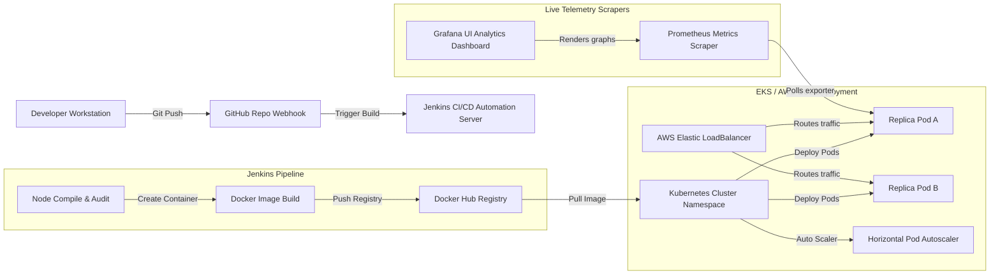

# DevOps-Based Containerized Smart E-Commerce Platform

Welcome to the **DevOps-Based Containerized Smart E-Commerce Platform** project repository. This application has been designed as a high-fidelity, presentation-ready e-commerce software solution, specifically tailored to showcase modern DevOps orchestration principles, continuous integration pipelines, container scaling, and cloud deployment topologies.

---

## 🏗️ DevOps Architecture Diagram

Below is the orchestration lifecycle workflow representing developer checkins, pipeline triggers, container uploads, and cloud deployments:



---

## 🚀 Key Features

* **High-Fidelity UI/UX**: Sleek dark/light theme options, beautiful transitions, and product inventory catalogs.
* **DevOps Simulator widgets**: Custom dashboard overlays rendering live cluster active nodes, memory loads, and pipeline metrics.
* **Persistent States**: Cart, past orders, and custom catalogs persisted locally in browser LocalStorage.
* **Multi-Stage Containerization**: Custom Docker configurations generating Alpine-based Nginx builds under 35MB.
* **Horizontal Pod Autoscaling**: Pre-configured Kubernetes HPA manifests set up to scale from 2 to 10 pods automatically.
* **Telemetry Concepts**: Integrated Prometheus scrapes setup and Grafana dashboard layout templates.

---

## 🛠️ Technology Stack

* **Frontend**: React.js, Tailwind CSS, Recharts, Lucide Icons
* **Containerization**: Docker, Docker Compose
* **Orchestration**: Kubernetes (Minikube / EKS)
* **Automation CD**: Jenkins Pipeline
* **Monitoring**: Prometheus & Grafana
* **Cloud Infrastructure**: AWS EC2 / Elastic Load Balancer

---

## 📂 Folder Structure

```
.
├── k8s/                            # Kubernetes Manifest Files
│   ├── configmap.yaml              # Environment key-value setups
│   ├── deployment.yaml             # Pod templates & replicas
│   ├── service.yaml                # Public LoadBalancer mapping
│   ├── ingress.yaml                # Path routing configuration
│   └── hpa.yaml                    # Horizontal Pod Autoscaling limits
├── monitoring/                     # Scraper telemetry files
│   ├── prometheus.yml              # Prometheus scrape jobs configuration
│   └── grafana-dashboard.json      # Telemetry Dashboard template JSON
├── src/                            # React Project Source Code
│   ├── components/                 # Shared UI elements
│   ├── context/                    # App State Context providers
│   ├── data/                       # Product inventory mock catalogs
│   ├── pages/                      # Cart, Orders, Admin & Shop Pages
│   └── main.jsx                    # Core entry points
├── Dockerfile                      # Production stage build rules
├── docker-compose.yml              # Local multi-container launch layout
├── nginx.conf                      # Nginx cache and server configurations
└── Jenkinsfile                     # Declarative multi-stage CD pipeline
```

---

## 💻 Local Quickstart Guide

### 1. Prerequisite Installations
* **Node.js**: v18.0+
* **Docker Desktop**: Installed and running

### 2. Manual Development Mode Run
```bash
# Clone and navigate into directory
cd DevOps_Final

# Install packages
npm install

# Launch Dev Server
npm run dev
```
Open [http://localhost:5173](http://localhost:5173) in your browser to view the application.

---

## 🐳 Dockerized Deployment Guide

### 1. Build and Run Local Docker Image
```bash
# Build the Docker image
docker build -t your-username/devops-smart-ecommerce:latest .

# Run the single container
docker run -d -p 8080:80 --name my-ecommerce-app your-username/devops-smart-ecommerce:latest
```
Verify the build by navigating to [http://localhost:8080](http://localhost:8080).

### 2. Multi-Container Orchestration (Docker Compose)
```bash
# Boot the combined services (Frontend + Nginx Prom Exporter)
docker-compose up -d

# Check running containers
docker-compose ps
```
The application runs on [http://localhost:8080](http://localhost:8080) and Prometheus metrics exporter displays raw data on [http://localhost:9113](http://localhost:9113).

---

## ☸️ Kubernetes Local Deployment (Minikube)

```bash
# Start Minikube cluster
minikube start

# Apply manifests (ordered logically)
kubectl apply -f k8s/configmap.yaml
kubectl apply -f k8s/deployment.yaml
kubectl apply -f k8s/service.yaml
kubectl apply -f k8s/hpa.yaml
kubectl apply -f k8s/ingress.yaml

# Verify resource allocation status
kubectl get pods,svc,hpa

# Enable Minikube service routing
minikube service frontend-service
```

---

## ☁️ AWS EC2 Production Cloud Deployment

### Step 1: Launch an AWS EC2 Instance
1. Log in to your AWS Management Console.
2. Launch an **Ubuntu Server 22.04 LTS (HVM)** instance (t2.micro is eligible for free-tier).
3. Set Security Group rules to expose ports:
   * **`22`** (SSH Remote access)
   * **`80`** / **`8080`** (Web Client HTTP access)

### Step 2: Establish Remote Shell Connection
```bash
# SSH into instance using your private key PEM file
ssh -i "your-key.pem" ubuntu@your-ec2-public-ip
```

### Step 3: Install Docker and Docker Compose
```bash
# Update local packages
sudo apt update && sudo apt upgrade -y

# Install Docker dependencies
sudo apt install -y docker.io docker-compose

# Start and enable Docker daemon
sudo systemctl start docker
sudo systemctl enable docker
sudo usermod -aG docker ubuntu
```
*(Exit terminal session and log back in to activate group privileges).*

### Step 4: Pull and Run App Container
```bash
# Pull production image from registry
sudo docker pull your-username/devops-smart-ecommerce:latest

# Spin up web server container exposing EC2 HTTP port 80
sudo docker run -d -p 80:80 --restart always --name prod-ecommerce your-username/devops-smart-ecommerce:latest
```
Access the public website by typing the `http://your-ec2-public-ip` into your browser.
